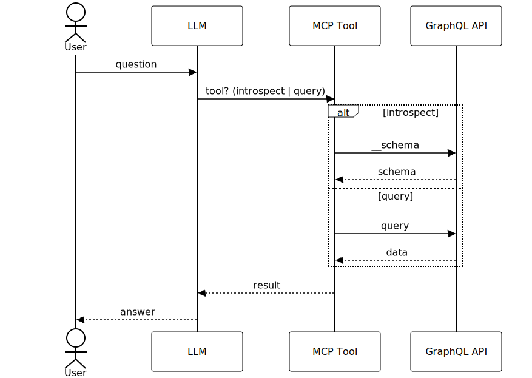
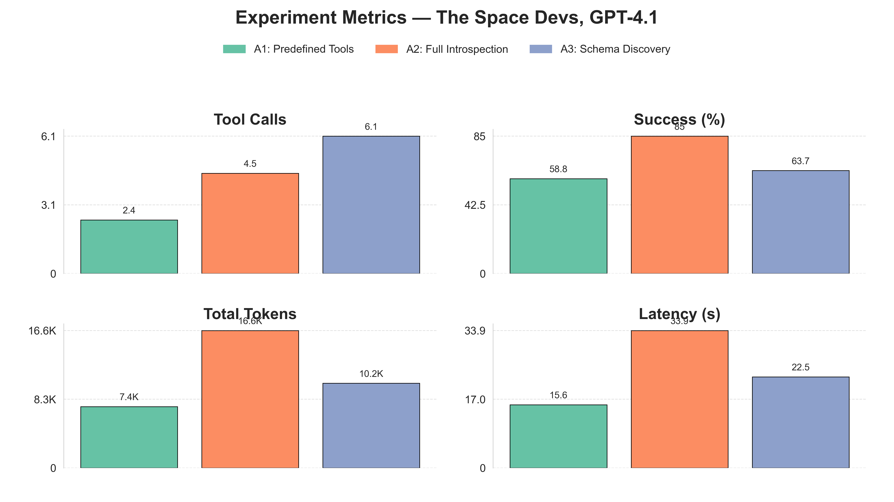

# GraphQL MCP Server

A lightweight, experimental GraphQL server in Rust designed to bridge [Model Context Protocol (MCP)] with GraphQL.  
This project enables rapid prototyping, experimentation, and learning.



## Overview

This project provides a GraphQL MCP server implemented in Rust, as well as test servers for local development:

- **High performance** through Rust.
- **Modular**: Easily connect to custom GraphQL endpoints using different exploration strategies.
- **Flexible**: Choose between **Discovery** or **Fullschema** exploration at runtime.
- **Ideal for experimentation and learning**: Observe live tool calls, responses, and server behavior.

---

## Services

- **graphql-mcp**: Main GraphQL MCP server. Run via Docker or Cargo. Forwards calls to a specified GraphQL endpoint.
- **test-graphql-server**: Mock GraphQL endpoint for testing MCP integration.
- **test-llm-server**: Mock LLM server for end-to-end prototyping and local dev.

---

## Prerequisites

- [Rust & Cargo](https://rustup.rs/) (required)
- [Docker](https://www.docker.com/) (optional, for containerized deployment)

---

## Setup & Getting Started

### 1. Clone the Repository

```bash
git clone https://github.com/ThoreKoritzius/graphql-mcp.git
cd graphql-mcp
```

### 2. Setup Environment

Create a `.env` file in the root directory with:

```
OPENAI_API_KEY=your_openai_api_key
```

### 3. Run with Cargo

Run the server, specifying your GraphQL endpoint and exploration strategy:

```bash
# Discovery strategy (default)
cargo run -- --endpoint http://127.0.0.1:3000 --strategy discovery

# Fullschema strategy
cargo run -- --endpoint http://127.0.0.1:3000 --strategy fullschema
```

The server will be available at: [http://localhost:5001](http://localhost:5001)

> **Note:** The strategy flag controls whether the server uses the lightweight **Discovery** explorer (field-by-field introspection) or the **Fullschema** explorer (fetches the entire schema at once).

### 4. (Optional, Easy Full Setup) Or test the full setup - Run with Docker Compose

Launch all services with:

```bash
docker-compose up --build
```

When all services are running, visit [http://localhost:3000/](http://localhost:3000/) for a demo chat UI with live tool calls and answers.

Control your ednpoint and strategy via the docker compose environment variables

```yaml
services:
  graphql-mcp:
    environment:
      - RUST_LOG=debug
      - ENDPOINT=http://test-graphql-server:8000 # or your desired GraphQL endpoint
      - STRATEGY=discovery # or 'fullschema'
```


---

## Usage

- The **main server** (graphql-mcp) listens on port `5001` by default.
- To connect your own LLM service (e.g., Claude, OpenAI, etc.), configure your MCP client:

```json
{
  "mcpServers": {
    "graphql_mcp": {
      "url": "http://graphql-mcp-server:5001/sse"
    }
  }
}
```

- Tools registered by the server are automatically exposed for the chosen strategy:
  - **Discovery**: field-by-field inspection, SDL snippets, and query execution.
  - **Fullschema**: complete schema introspection and query execution.

---

## Configuration

- Set GraphQL endpoint with `--endpoint http://your-endpoint`
- Select exploration strategy with `--strategy discovery|fullschema`
- Set your OpenAI API key in `.env`
- Exposed ports:
  - `5001` (GraphQL MCP server)
  - `3000` (Demo UI)

---

## Inspector Integration (Optional)

To introspect and debug MCP traffic live, use the [MCP Inspector](https://github.com/modelcontextprotocol/inspector):

```bash
npx @modelcontextprotocol/inspector http://localhost:5001/sse
```

- Select Transport Type: `SSE`
- This enables live introspection and visualization of MCP traffic.

# Benchmarks

Benchmark scripts for the three strategies are located in the `bench` folder. To run benchmarks, simply bring up the required services using Docker Compose:

```bash
docker compose up
```
and then run the `bench.py` script, which runs the `dataset.csv` throguh the test-client and captures results and graphs.

**Configuration Example:**

For the `main` and `control` services, you can configure the following environment variables:

```yaml
services:
  graphql-mcp:
    environment:
      - RUST_LOG=debug
      - ENDPOINT=http://test-graphql-server:8000 # or your desired GraphQL endpoint
      - STRATEGY=discovery # or 'fullschema'
```

We benchmarked our server using all three strategies on the [SpaceDevs Example Schema](https://thespacedevs-production.up.railway.app) and our benchmark dataset.

**Results:**



